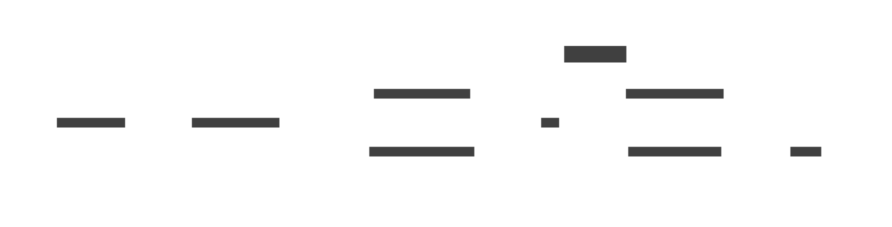

## architecture

## Kafka

### 구현한 것

- kafka
  - docker로 kafka 띄움
  - localhost:19092로 접근하면 됨
- producer
  - naver, youtube 반응 크롤링 구현
  - naver, youtube 반응 모두 ChatModel 모델 형태로 통일해서 produce
  - 임시로 각각의 producer file 의 마지막 부분에 실행 가능한 코드 첨부. video_id, page_id 변경해서 실행가능
- consumer
  - 테스트 용도로 구현함

### 실행법

```
cd be
docker compose up -d
pipenv run python naver_chat_producer_main.py
pipenv run python youtube_chat_producer_main.py
pipenv run python chat_consumer_main.py

작동하는 것 확인 후..

docker compose down -v
```

## Game Schedule Scheduler

10분마다 경기 일정을 가져와서 파일에 저장합니다.

```
cd be
docker compose up -d
pipenv run python game_schedule_scheduler_main.py
```

## 실행확인
### websocket-consumer
requirement: [websocat](https://github.com/vi/websocat) 웹소켓 테스트용

```
docker compose up -d kafka
pipenv run python mock_producer.py
pipenv run python websocket_consumer_main.py

websocat ws://127.0.0.1:9091/ # port는 .websocket_consumer.env에 따라 바뀔 수 있음

```
